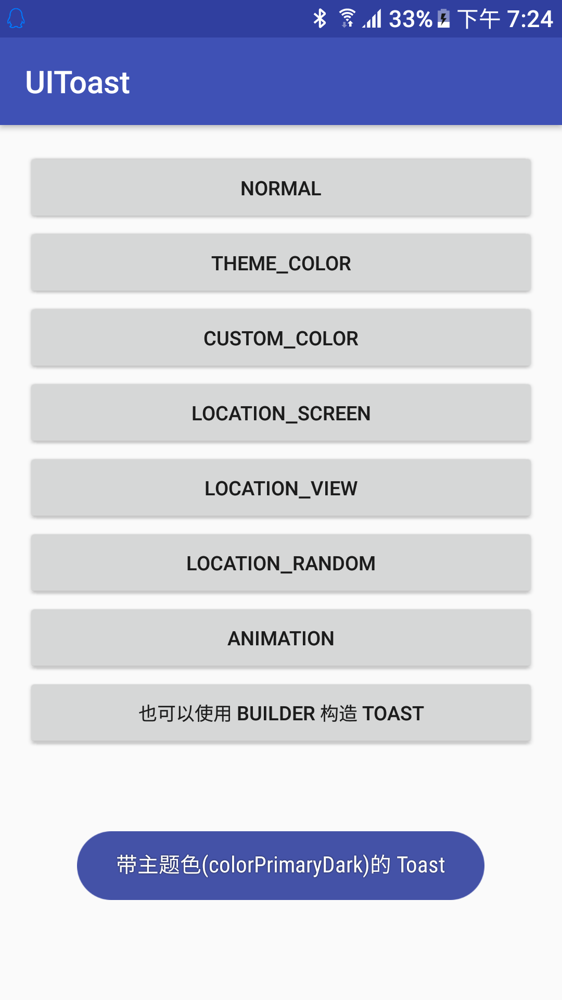

# Android 运行时改变 Drawable 的填充色[Toast 样式的进阶版]

> 这两天无聊,整了 `Toast`的样式库
> 先贴地址: **[https://github.com/didikee/UIToast](https://github.com/didikee/UIToast)**

## 1. 关于 Toast 样式的修改
**参见我上一篇文章:[更换 Android 原生 Toast 的样式](http://www.jianshu.com/p/ca8d7dd6172e)**

## 2. 运行时改变 Drawable 的填充色
以 Toast的背景为例说明, Toast的背景是一个名为 `toast_frame.9.png`的 点9 png图,处理完的效果如图:


Toast 的背景已经变为 `colorPrimaryDark`的颜色.

实现是利用 Android Tint(翻译为: 着色),Android 5.0以上默认支持的,为了兼容,我们使用 `Android Support V4` 的包中提供了 `DrawableCompat`类,辅助我们为 Drawable 着色:

```
public static Drawable tintDrawable(Drawable drawable, ColorStateList colors) {  
    final Drawable wrappedDrawable = DrawableCompat.wrap(drawable);
    DrawableCompat.setTintList(wrappedDrawable, colors);
    return wrappedDrawable;
}
```

这样已经能轻易的实现 `Drawable`的着色了,但是还没完,还有一个很重的知识点要说明.也许你在使用了这个方法后你会发现,你调用系统自带的 `Toast.makeToast(...);`方法背景也变成了之前的颜色而不是默认的暗黑色.

这是因为 `Android 为了优化系统性能，资源 Drawable 只有一份拷贝，你修改了它，等于所有的都修改了`.也就是说同一份资源的状态(比如pressed 等)是共享的.不过, Drawable 提供了一个方法 **`mutate()`**，来打破这种共享状态，等于就是要告诉系统，我要修改（mutate）这个 Drawable.
当然,Android 系统只是储存了一份 Drawable 的状态值,而非缓存整个 Drawable,所以不必担心性能问题.

实际应用的代码片段如下:
```
Drawable toastBackgroundDrawable = TintDrawableUtil.tintDrawable(
		toastView.getBackground().mutate(),//mutate(),设置为状态不共享,以免影响系统默认的 Toast背景.
		ColorStateList.valueOf(toastBackgroundColor));
```

## 3. 下面是介绍我写的Toast的库了
**包含的功能:**
```
1. 自定义 Toast 字体颜色
2. 自定义 Toast 背景颜色
3. 自定义 Toast 展示位置(类似 Popupwindow 在某某下方(正下方水平居中)展示)
4. 自定义 Toast 进出场动画
```

以上四种可以混搭,库比较轻量,三个类,但是依赖 v4包,想想v4已经是众多app必备了我就直接用了.如果有必要的话我可以写个不需要 v4包的.
地址: **[https://github.com/didikee/UIToast](https://github.com/didikee/UIToast)**

> 参考资料: [Drawable 着色的后向兼容方案](http://www.race604.com/tint-drawable/)
> 在搜索到这篇文章时我觉得我的不用写了,人家写的比我好,但是为了记录也为了把更好的分享给大家,我还是把这篇文章贴在这里,enjoy~

