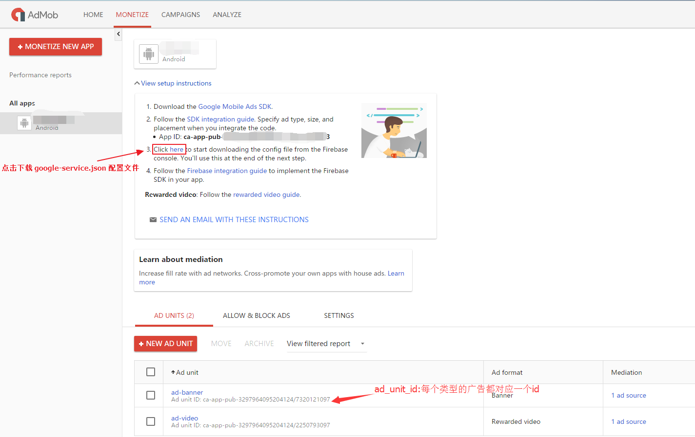
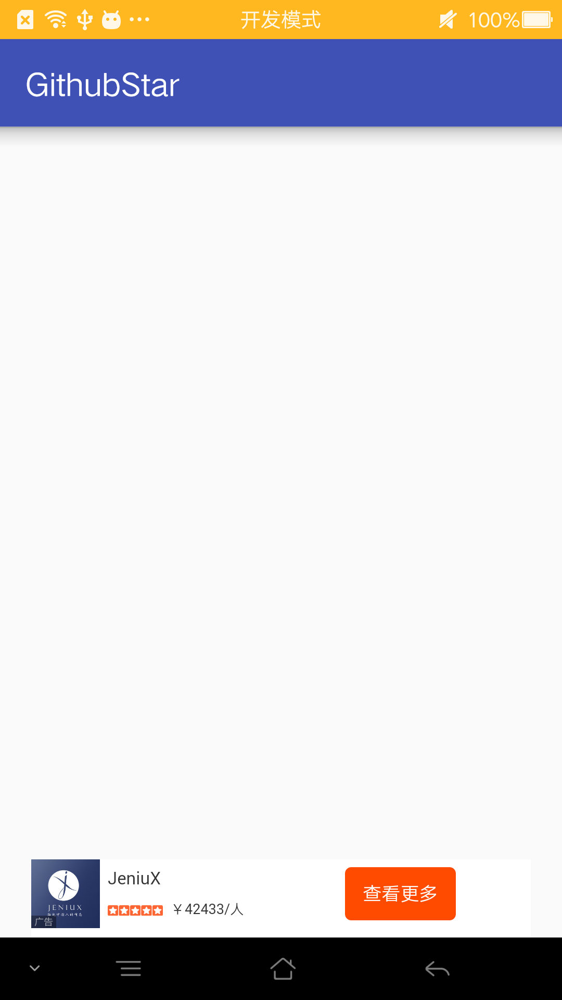

# Android Google AdMob 广告接入示例

[TOC]

> 首先请大家放心，虽然 Google搜索等服务被qiang了，但是 广告服务国内还是可以用的，真是普天同庆啊~~~噗！
> 
> 其实这篇文章也只是记录我接入 AdMob 的过程，更具体的其实 Google 官方给的更详细（配图和视频还有GitHub 的demo 示例等），所以不想看官方（毕竟大部分英文）的可以看我写的，如果已经看了官方或者有了解了可以重点看我** 加粗 **的地方，方便你快速找到你想要的信息。
> 
> Google 官方引导：[https://firebase.google.com/docs/admob/?hl=zh-cn](https://firebase.google.com/docs/admob/?hl=zh-cn)

## 0. 什么是 AdMob ?

AdMob by Google 是一种移动广告平台，借助该平台您可从您的应用中获得可观的收入。将 AdMob 与 Firebase Analytics 相结合，您不仅可得到更多的应用使用量数据，而且可以提升分析能力。无需更改现有 AdMob 配置，Firebase 便可与 AdMob 集成在一起。

## 1. AdMob 广告的类型 ？

总共分四种。
分别为：**Banner（横幅广告）** 、**Interstitial（插页广告）**、**Rewarded Video（应用内购买广告）**、**Native（原生广告）**。

- Banner（横幅广告）：最常见的，就是平时看到的屏幕的底部或者顶部有一个横条的广告条。
- Interstitial（插页广告）：类似启动页广告，整个屏幕显示一副广告。
- Rewarded Video（应用内购买广告）：这个玩国外游戏经常会看到，你看完一个广告视频，游戏会奖励你一些道具或者其他的什么（**这个奖励是一个整数，在AdMob中可以设置数量，用户看完视频会得到这个数量的奖励，比如奖励3瓶药水，3条生命等。**）。
- Native（原生广告）：这个是体验最好的广告形式，和原生app无缝对接，也许你已经见过一个列表的某个item内容展示的是广告，就是这种形式。

## 2. 以 Banner 广告为例，接入AdMob

### 2-1.账号

**你需要 Google 账号**，然后注册AdMob，如果有 Google 账号是可以直接登录的。
有了账号以后你才能继续！

**NOTICE：如果 AdMob 登录页面打不开（其他页面是可以打开的），请务必禁止 AdBlock 等屏蔽广告的插件，或者手动添加白名单！！！**

### 2-2. 在 AdMob 上创建新的项目

推荐你把 Google 官方的示例写一遍，不费事的。

在 AdMob 上创建新的项目，[https://apps.admob.com/](https://apps.admob.com/)，中间提示你填写**包名、项目名等**，如实填写就可以。

最后完成时你的界面应该是这样的：



注意你的 `APP id ,ad unit id,`,并 **下载 google-service.json**配置文件。

### 2-3. Android Studio 项目配置

**配置 Gradle **

1.项目级 build.gradle

```
    dependencies {
        classpath 'com.android.tools.build:gradle:x.x.x'
        classpath 'com.google.gms:google-services:3.0.0'
    }
```

2.应用级 build.gradle

```
...
    dependencies {
            compile fileTree(dir: 'libs', include: ['*.jar'])
            compile 'com.android.support:appcompat-v7:xx.x.x'
            compile 'com.google.firebase:firebase-ads:10.2.1'
        }
...
//apply plugin 语句位于底部
apply plugin: 'com.google.gms.google-services'
```

3.google-service.json

直接粘贴在**应用级**的根目录下，例如：**YourProject/app/google-service.json**

### 2-4. Eclipse 项目配置


### 2-5. xml 布局编写

主页面布局：**activity_main.xml**

```
<RelativeLayout xmlns:android="http://schemas.android.com/apk/res/android"
    xmlns:tools="http://schemas.android.com/tools" android:layout_width="match_parent"
    xmlns:ads="http://schemas.android.com/apk/res-auto"
    android:layout_height="match_parent" android:paddingLeft="@dimen/activity_horizontal_margin"
    android:paddingRight="@dimen/activity_horizontal_margin"
    android:paddingTop="@dimen/activity_vertical_margin"
    android:paddingBottom="@dimen/activity_vertical_margin"
    tools:context=".MainActivity">

    <TextView android:text="@string/hello_world" android:layout_width="wrap_content"
        android:layout_height="wrap_content" />

    <com.google.android.gms.ads.AdView
        android:id="@+id/adView"
        android:layout_width="wrap_content"
        android:layout_height="wrap_content"
        android:layout_centerHorizontal="true"
        android:layout_alignParentBottom="true"
        ads:adSize="BANNER"
        ads:adUnitId="@string/banner_ad_unit_id">
    </com.google.android.gms.ads.AdView>

</RelativeLayout>
```

### 2-6. Activity 加载 Banner 广告

MainActivity.java 部分代码：
```
package ...

import ...
import ...
import com.google.android.gms.ads.AdRequest;
import com.google.android.gms.ads.AdView;

public class MainActivity extends ActionBarActivity {

    ...

    protected void onCreate(Bundle savedInstanceState) {
        super.onCreate(savedInstanceState);
        setContentView(R.layout.activity_main);

		//加载广告
        AdView mAdView = (AdView) findViewById(R.id.adView);
        AdRequest adRequest = new AdRequest.Builder().build();
        mAdView.loadAd(adRequest);
    }

    ...

}
```

做完主要不要忘记权限：

```
    <uses-permission android:name="android.permission.INTERNET"/>
    <uses-permission android:name="android.permission.ACCESS_NETWORK_STATE"/>
```


### 2-7. Google AdMob Demo 地址


官方demo地址： [https://github.com/googleads/googleads-mobile-android-examples](https://github.com/googleads/googleads-mobile-android-examples)

## 3. 效果图

在页面底部展示 Banner 广告条:



## 4. 注意事项

**<: NOTICE :>**

**当你注册完 AdMob 账户，创建完项目，得到对应的 id ，准备进行测试时，你可能得到一些错误：failed to load ad 3，或者， There was a problem getting an ad response. ErrorCode: 0等。**

**请注意，你创建的项目需要等待一段时间才能测试使用，所以尽管你的代码和配置都是正确的，但还是收到错误。等待一段时间就好了，我大概过了2个多小时才正常。**

**<: NOTICE :> 关于 Rewarded Video（应用内购买广告）**

你在测试时很大几率得到错误提示----**failed to load ad 3**，并且方法的失败回调响应了。

**这只是系统没有什么广告返回给你而已，也就是应用内视频广告并不总是会有的。**

错误信息可以在官网得到解释：

```
public static final int ERROR_CODE_NO_FILL  --> Constant Value: 3

The ad request was successful, but no ad was returned due to lack of ad inventory.
广告请求已成功，但由于缺少广告资源，没有返回任何广告。
```

更多错误信息可以查看官网：[https://developers.google.com/android/reference/com/google/android/gms/ads/AdRequest](https://developers.google.com/android/reference/com/google/android/gms/ads/AdRequest)

## 5. 总结

Google 的广告听说比较用心，实际效果不知如何，本文描述不全的或者日后有改动的都以官网为准。

官网：[http://www.google.cn/admob/](http://www.google.cn/admob/)

enjoy!
