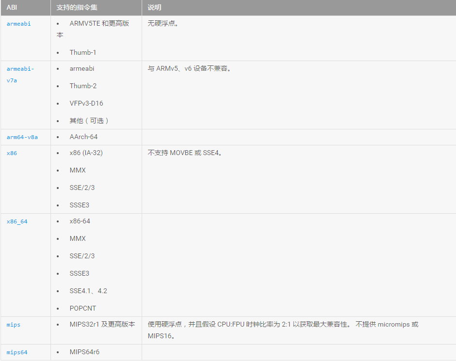
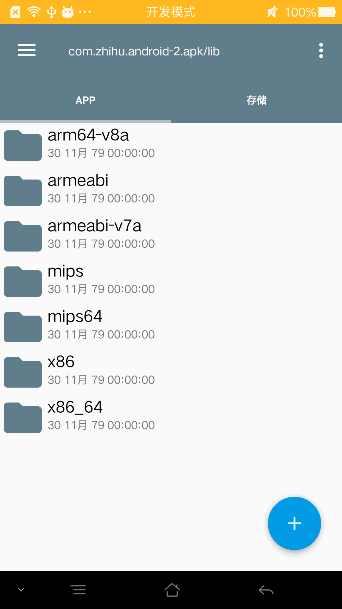

# Android 瘦身之道 ---- so文件

[TOC]

## 1. 前言

目前Android 瘦身只有几个方面可以入手，因为apk的结构就已经固定了。

1. res 目录下的资源文件。（通常是压缩图片，比如 矢量图 --> webp --> png 等。）
2. src 目录下的java文件。（通常是混淆，压缩等。）
3. asset 目录下的资源文件。（类似 res 目录。）
4. lib 目录下的第三方库。（gradle 依赖的其实也可以算到这个目录下，一般就是不要引用重复功能的第三方库等。）
5. so库 （这个其实是很顽固的东西，你没法压缩它，如果没有用到还好，用到了它体积3MB就是 3MB 没有压缩的空间了，更要命的是通常还不止放一套！本文主要谈这个。）

关于 APK 瘦身，我觉得这篇文章总结的不错：[Android-APP终极瘦身指南](http://www.jayfeng.com/2016/03/01/Android-APP%E7%BB%88%E6%9E%81%E7%98%A6%E8%BA%AB%E6%8C%87%E5%8D%97/)

## 2. ABI 的种类

官方的一张表格列举了常用的几种 CPU 架构。

## 3. 目前主流 APP 所用的 ABI 各是哪些

数据是 **2017/4/8**看的市场最新版，采集的几个代表性样本如下：

**仅有 armeabi ：** 微博，今日头条，淘宝，QQ，微信。
**armeabi 与 armeabi-v7a：** UC 浏览器。
**armeabi，armeabi-v7a，armeabi-x86：**优酷，哔哩哔哩动画。
**7种类型全有：**知乎。

我也看了目前流行的游戏 王者荣耀（因为我只安装了它。。。哈哈），发现它**仅有 armeabi-v7a**。

## 4. ABI 兼容性

目前搜索的资料总结如下：

- armeabi-v7a ：armeabi-v7a向下兼容armeabi
- arm64-v8a ： 能兼容 armeabi-v7a 和 armeabi
- x86_64 ： 兼容 x86
- mips64 ： 兼容 mips

**注意： 兼容只是理论上的，实际还是可能有极少数手机会崩溃，这是不可避免的。**

## 5. 动态加载 so 文件

当你加上更多的支持架构之后，发现包体的增长已经影响了用户的下载意愿。广告的转化率提不上去啊，运营会找你麻烦的！

可能的一个解决方法是：分别发不同架构的包，让用户自己去选择（太傻了，而且用户哪有那么聪明）。

**最好的方案还是动态下载 so 文件，发布的 APK 不包含 Native 代码，启动时根据不同的架构下载相应的 so 文件。**

道理很简单，而且网上也有一堆堆的教程，我也不细说。需要注意的是一定要将下载的 so 文件放置在程序目录才可以 load，否则会遇到权限问题。

## 6. 总结

实际我们只需要保留 **armeabi**差不多就够了，更好的方案是动态的加载 so文件，已达到兼容性和apk文件大小的控制的目的。
