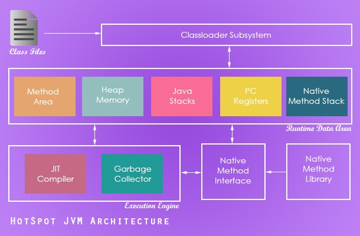

# Java 垃圾回收(GC) 泛读

[TOC]

> 文章地址：[https://segmentfault.com/a/1190000008922319](https://segmentfault.com/a/1190000008922319)

## 0. 序言

带着问题去看待 垃圾回收（GC） 会比较好，一般来说主要的疑惑在于这么几点：

- 为什么需要 GC ？
- 虚拟机（JVM） 与 垃圾回收（GC） 的关系？
- GC 的原理有哪些？
- 哪些 对象容易被 GC ？
- 等等

带着这些问题往下看：

## 1. 为什么需要 GC ？

**GC**： 是`Garbage Collection` 的英文缩略，垃圾收集的意思。

**为什么需要 GC？**
主要是随着应用程序所应对的业务越来越庞大、复杂，用户越来越多，没有GC就不能保证应用程序正常进行。

**为什么经常讨论 GC，没有完美的解决方案吗？**
完美的解决方法目前还没有。由于在 GC 时需要STW（Stop The World），这长不能满足实际的需求，容易造成卡顿、延迟等性能问题，所以才会不断地尝试对GC进行优化。社区的需求是尽量减少对应用程序的正常执行干扰，这也是业界目标。


## 2. 虚拟机（JVM） 与 GC 的关系 ？

以 HotSpotJVM 为例描述下 GC 在 JVM 中的位置：



由于 不同的 JVM 会有不同的 GC 实现，不同的 GC 实现使用的算法又不尽相同，这才造成了 GC 的多样性。
在收购SUN之前，Oracle使用的是JRockit JVM，收购之后使用HotSpot JVM。目前Oracle拥有两种JVM实现并且一段时间后两个JVM实现会合二为一。
HotSpot JVM是目前Oracle SE平台标准核心组件的一部分。
最新的 GC 方案是 `Garbage First`（一般简称为 G1）。

## 3. GC 的种类

### 1. GC 的发展历程

1. 1999年随JDK1.3.1一起来的是串行方式的Serial GC ，它是第一款 GC 。
2. 2002年2月26日，J2SE1.4发布，Parallel GC 和Concurrent Mark Sweep （CMS）GC跟随JDK1.4.2一起发布，**并且Parallel GC在JDK6之后成为HotSpot默认GC**。

### 2. 不同 GC 的区别

HotSpot有这么多的垃圾回收器，那么如果有人问，Serial GC、Parallel GC、Concurrent Mark Sweep GC这三个GC有什么不同呢？请记住以下口令：

如果你想要最小化地使用内存和并行开销，请选Serial GC；
如果你想要最大化应用程序的吞吐量，请选Parallel GC；
如果你想要最小化GC的中断或停顿时间，请选CMS GC。

当然这不包括新推出的 GC 方案----G1。

### 3. 关于 Java 1.7 之后的 G1

**为什么名字叫做Garbage First（G1）呢？**

因为G1是一个并行回收器，它把堆内存分割为很多不相关的区间（Region），每个区间可以属于老年代或者年轻代，并且每个年龄代区间可以是物理上不连续的。

老年代区间这个设计理念本身是为了服务于并行后台线程，这些线程的主要工作是寻找未被引用的对象。而这样就会产生一种现象，即某些区间的垃圾（未被引用对象）多于其他的区间。

垃圾回收时实则都是需要停下应用程序的，不然就没有办法防治应用程序的干扰 ，然后G1 GC可以集中精力在垃圾最多的区间上，并且只会费一点点时间就可以清空这些区间里的垃圾，腾出完全空闲的区间。

绕来绕去终于明白了，由于**这种方式的侧重点在于处理垃圾最多的区间，所以我们给G1一个名字：垃圾优先（Garbage First）**。

## 4. GC 的原理

### 1. 对象存活判断

判断对象是否存活一般有两种方式：

- **引用计数**：每个对象有一个引用计数属性，新增一个引用时计数加1，引用释放时计数减1，计数为0时可以回收。此方法简单，无法解决对象相互循环引用的问题。

- **可达性分析（Reachability Analysis）**：从GC Roots开始向下搜索，搜索所走过的路径称为引用链。当一个对象到GC Roots没有任何引用链相连时，则证明此对象是不可用的。不可达对象。

在Java语言中，GC Roots包括：虚拟机栈中引用的对象、方法区中类静态属性实体引用的对象、方法区中常量引用的对象、本地方法栈中JNI引用的对象。

### 2. GC 常用的算法及原理

**引用计数法 (Reference Counting)**

引用计数器在微软的 COM 组件技术中、Adobe 的 ActionScript3 种都有使用。
引用计数器的实现很简单，对于一个对象 A，只要有任何一个对象引用了 A，则 A 的引用计数器就加 1，当引用失效时，引用计数器就减 1。只要对象 A 的引用计数器的值为 0，则对象 A 就不可能再被使用。
引用计数器的实现也非常简单，只需要为每个对象配置一个整形的计数器即可。**但是引用计数器有一个严重的问题，即无法处理循环引用（即两个对象相互引用）的情况。因此，在 Java 的垃圾回收器中没有使用这种算法**。
一个简单的循环引用问题描述如下：有对象 A 和对象 B，对象 A 中含有对象 B 的引用，对象 B 中含有对象 A 的引用。此时，对象 A 和对象 B 的引用计数器都不为 0。但是在系统中却不存在任何第 3 个对象引用了 A 或 B。也就是说，A 和 B 是应该被回收的垃圾对象，但由于垃圾对象间相互引用，从而使垃圾回收器无法识别，引起内存泄漏。

**标记-清除算法 (Mark-Sweep)**

标记-清除算法将垃圾回收分为两个阶段：标记阶段和清除阶段。一种可行的实现是，在标记阶段首先通过根节点，标记所有从根节点开始的较大对象。因此，未被标记的对象就是未被引用的垃圾对象。然后，在清除阶段，清除所有未被标记的对象。该算法最大的问题是存在大量的空间碎片，因为回收后的空间是不连续的。在对象的堆空间分配过程中，尤其是大对象的内存分配，不连续的内存空间的工作效率要低于连续的空间。

**复制算法 (Copying)**

将现有的内存空间分为两快，每次只使用其中一块，在垃圾回收时将正在使用的内存中的存活对象复制到未被使用的内存块中，之后，清除正在使用的内存块中的所有对象，交换两个内存的角色，完成垃圾回收。
如果系统中的垃圾对象很多，复制算法需要复制的存活对象数量并不会太大。因此在真正需要垃圾回收的时刻，复制算法的效率是很高的。又由于对象在垃圾回收过程中统一被复制到新的内存空间中，因此，可确保回收后的内存空间是没有碎片的。该算法的缺点是将系统内存折半。
Java 的新生代串行垃圾回收器中使用了复制算法的思想。新生代分为 eden 空间、from 空间、to 空间 3 个部分。其中 from 空间和 to 空间可以视为用于复制的两块大小相同、地位相等，且可进行角色互换的空间块。from 和 to 空间也称为 survivor 空间，即幸存者空间，用于存放未被回收的对象。
在垃圾回收时，eden 空间中的存活对象会被复制到未使用的 survivor 空间中 (假设是 to)，正在使用的 survivor 空间 (假设是 from) 中的年轻对象也会被复制到 to 空间中 (大对象，或者老年对象会直接进入老年带，如果 to 空间已满，则对象也会直接进入老年代)。此时，eden 空间和 from 空间中的剩余对象就是垃圾对象，可以直接清空，to 空间则存放此次回收后的存活对象。这种改进的复制算法既保证了空间的连续性，又避免了大量的内存空间浪费。

**标记-压缩算法 (Mark-Compact)**

复制算法的高效性是建立在存活对象少、垃圾对象多的前提下的。这种情况在年轻代经常发生，但是在老年代更常见的情况是大部分对象都是存活对象。如果依然使用复制算法，由于存活的对象较多，复制的成本也将很高。
标记-压缩算法是一种老年代的回收算法，它在标记-清除算法的基础上做了一些优化。也首先需要从根节点开始对所有可达对象做一次标记，但之后，它并不简单地清理未标记的对象，而是将所有的存活对象压缩到内存的一端。之后，清理边界外所有的空间。这种方法既避免了碎片的产生，又不需要两块相同的内存空间，因此，其性价比比较高。

**增量算法 (Incremental Collecting)**

在垃圾回收过程中，应用软件将处于一种 CPU 消耗很高的状态。在这种 CPU 消耗很高的状态下，应用程序所有的线程都会挂起，暂停一切正常的工作，等待垃圾回收的完成。如果垃圾回收时间过长，应用程序会被挂起很久，将严重影响用户体验或者系统的稳定性。
增量算法的基本思想是，如果一次性将所有的垃圾进行处理，需要造成系统长时间的停顿，那么就可以让垃圾收集线程和应用程序线程交替执行。每次，垃圾收集线程只收集一小片区域的内存空间，接着切换到应用程序线程。依次反复，直到垃圾收集完成。使用这种方式，由于在垃圾回收过程中，间断性地还执行了应用程序代码，所以能减少系统的停顿时间。但是，因为线程切换和上下文转换的消耗，会使得垃圾回收的总体成本上升，造成系统吞吐量的下降。

**分代 (Generational Collecting)**

根据垃圾回收对象的特性，不同阶段最优的方式是使用合适的算法用于本阶段的垃圾回收，分代算法即是基于这种思想，它将内存区间根据对象的特点分成几块，根据每块内存区间的特点，使用不同的回收算法，以提高垃圾回收的效率。以 Hot Spot 虚拟机为例，它将所有的新建对象都放入称为年轻代的内存区域，年轻代的特点是对象会很快回收，因此，在年轻代就选择效率较高的复制算法。当一个对象经过几次回收后依然存活，对象就会被放入称为老生代的内存空间。在老生代中，几乎所有的对象都是经过几次垃圾回收后依然得以幸存的。因此，可以认为这些对象在一段时期内，甚至在应用程序的整个生命周期中，将是常驻内存的。如果依然使用复制算法回收老生代，将需要复制大量对象。再加上老生代的回收性价比也要低于新生代，因此这种做法也是不可取的。根据分代的思想，可以对老年代的回收使用与新生代不同的标记-压缩算法，以提高垃圾回收效率。

## 5. 以 分代(Generational Collecting) 算法为例，说明 GC 机制

词汇汇总：

```
Young generation ：新生代
Eden : 伊甸园 （每个新 New 出来的对象最开始存放的位置）
Survivor : 幸存区（图中S0与S1）
Tenured / Old Generation ：老年代
Permanent Generation ：永久代

```


**注意： S0 与 S1 的内存区域是一样大的**

下面讲述其 GC 过程：

**Step 1：**
新创建的对象一般放在新生代的Eden区。
在 Eden 中有 “存活对象” 与 “待回收对象”，当Eden空间被使用完的时候，就会发生新生代GC，也就是Minor GC。

**Step 2：**
GC 会做如何操作：

1. 把 “存活对象” 复制到S0中。
2. 清空 Eden 区。
3. 将 S0 中的 “存活对象” 年龄（Age）设置为 1。

这样第一次GC就完成了。
**Step 3：**
当Eden区再次被使用完的时候，就会再次进行GC操作。
GC 的操作如下：

1. 将 Eden 区和 S0 中的“存活对象” 复制 到S1中。
2. 清空 Eden 和 S0 区。
3. 然后将 Eden 中复制到 S1 中的对象年龄设置为 1，将 S0 中复制到 S1 中的对象年龄加 1。

这样新生代第二次GC就完成了。

**Step 4：**

当Eden再一次被使用完的时候，就会发生第三次GC操作了。
之后基本重复上面的思路了，
GC 操作如下：

1. 首先将 Eden 和 S1 中的 “存活对象” 复制到 S0 中。
2. 然后将 Eden 和 S1 进行清空。
3. 最后将 Eden 中复制到 S0 中的对象年龄设置为1，将 S1 中复制到 S0 中的对象年龄加1。

**之后就这样循环了~~~**

**那 老年代 呢？ 何时才会进入 老年代 ？**
如果对象在 GC 过程中没有被回收，那么它的对象年龄（Age）会不断的增加，对象在Survivor区每熬过一个Minor GC，年龄就增加1岁，当它的年龄到达一定的程度（默认为**15**岁），就会被移动到老年代，这个年龄阀值可以通过`-XX:MaxTenuringThreshold`设置。

## 6. 参考文章
这些文章或者视频资料都很不错，建议有兴趣可以看看。
[JVM 垃圾回收器工作原理及使用实例介绍](https://www.ibm.com/developerworks/cn/java/j-lo-JVMGarbageCollection/#ibm-pcon)
[Java GC系列（2）：Java垃圾回收是如何工作的？](http://www.importnew.com/13493.html)
[YouTube 视频：Garbage collection in Java, with Animation and discussion of G1 GC](https://www.youtube.com/watch?v=UnaNQgzw4zY)
[Java GC系列（1）：Java垃圾回收简介](http://www.importnew.com/13504.html)
[JVM内存回收理论与实现](http://www.infoq.com/cn/articles/jvm-memory-collection)
[JVM为什么需要GC](http://www.infoq.com/cn/articles/why-jvm-need-gc)

## 7. 结束

这些是整理的笔记，希望对你有帮助。

> 没有GC机制的JVM是不能想象的，我们只能通过不断优化它的使用、不断调整自己的应用程序，避免出现大量垃圾，**而不是一味认为GC造成了应用程序问题**。


