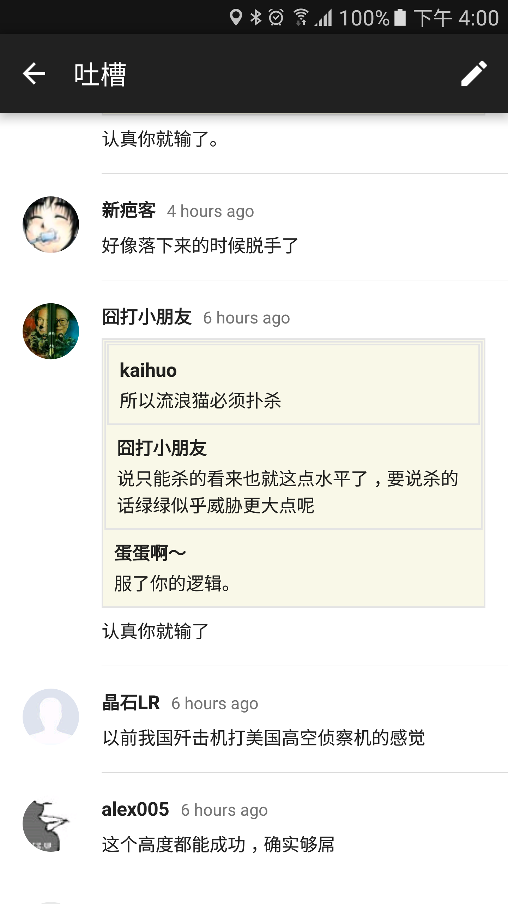
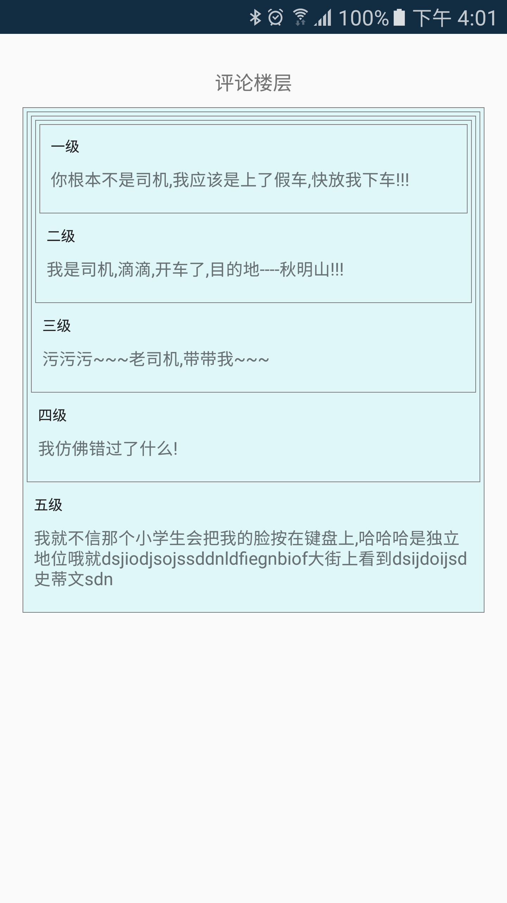

# 自定义View CommentsView 评论盖楼效果

先看看别的 app 的效果是如何:


再看看 demo 的效果:


## 开始代码吧

> 首先我想的是用 `LinearLayout` 去实现,达到层级少,然后一楼到最后一楼依次排序这样进行.最后发现在处理背景时不好弄了.然后就改为 `FrameLayout`去实现,其实思路也很简单,从一楼 A + padding 0 ,二楼 B + A 的padding + 细微调整, 三楼 在上一楼的基础上叠加.** 需要注意的是 一楼的布局最小,最后楼层的 布局最大,所以应该倒序放入 `FrameLayout` 中,否则会产生遮挡.**最终实现视觉上的差异化,盖楼就形成了.

## 关键代码片段解读

**1. 在 `TextView` 绘制前得到 其高度 **
```
    /**
     * 在绘制之前,测量 TextView 的高度
     * @param context  上下文
     * @param text 内容
     * @param textSize sp
     * @param deviceWidth TextView 所在容器的宽度[重要]
     * @param typeface 加粗等等样式
     * @param padding 内间距
     * @return TextView 的高度
     */
    public int getHeight(Context context, CharSequence text, int textSize, int deviceWidth, Typeface typeface, int padding) {
        TextView textView = new TextView(context);
        textView.setPadding(padding,padding,padding,padding);
        textView.setTypeface(typeface);
        textView.setText(text, TextView.BufferType.SPANNABLE);
        textView.setTextSize(TypedValue.COMPLEX_UNIT_SP, textSize);
        int widthMeasureSpec = View.MeasureSpec.makeMeasureSpec(deviceWidth, View.MeasureSpec.AT_MOST);
        int heightMeasureSpec = View.MeasureSpec.makeMeasureSpec(0, View.MeasureSpec.UNSPECIFIED);
        textView.measure(widthMeasureSpec, heightMeasureSpec);
        return textView.getMeasuredHeight();
    }
```
其他的代码还是直接看源码吧,主要是计算 View之间的间距.

**2. CommentsView **
```
public class CommentsView extends FrameLayout{
	private @ColorInt int mFloorBackgroundColor = Color.WHITE;// 楼层背景
    private int mFloorPadding = 0; //楼层叠加时,上左右的padding
    private @DrawableRes int mFloorBackgroundDrawableRes;

    public CommentsView(Context context) {
        this(context,null);
    }

    public CommentsView(Context context, AttributeSet attrs) {
        this(context, attrs,0);
    }

    public CommentsView(Context context, AttributeSet attrs, int defStyleAttr) {
        super(context, attrs, defStyleAttr);

        initParams();
    }

    private void initParams() {
        mFloorPadding = DisplayUtil.dp2px(getContext(),3);
        mFloorBackgroundDrawableRes = R.drawable.shape_comment_background;
        setBackgroundColor(mFloorBackgroundColor);
    }

    /**
     * 楼层
     * @param floorComments 1,2,3...依次排序
     */
    public void setFloors(List<CommentBean> floorComments){
        if (floorComments ==null || floorComments.size()<=0)return;
        int size = floorComments.size();
        int lastHeight = 0;
        ArrayList<Pair<View,FrameLayout.LayoutParams>> allView = new ArrayList<>();
        int almost = DisplayUtil.dp2px(getContext(), 32);
        for (int i = 0; i < size; i++) {
            LayoutParams floorLayoutParams = getFloorLayoutParams(size, i);
            CommentBean commentBean = floorComments.get(i);
            CommentItemView itemView =new CommentItemView(getContext());
            itemView.setTitle(commentBean.getName());
            itemView.setContent(commentBean.getContent());
//			每次的padding 都在累加,并且要减去相邻层级间的间距
            int paddingTop = lastHeight + mFloorPadding * i;
            Log.e("test","top: "+paddingTop);
            itemView.setPadding(0,paddingTop,0,0);
//            模仿 煎蛋盖楼
//            if (i == size -1 ){
//                itemView.setBackgroundColor(mFloorBackgroundColor);
//            }else {
//                itemView.setBackgroundResource(mFloorBackgroundDrawableRes);
//            }
//            demo 演示
            itemView.setBackgroundResource(mFloorBackgroundDrawableRes);
            allView.add(new Pair<View, LayoutParams>(itemView,floorLayoutParams));
            int alx1 = getHeight(getContext(),commentBean.getName(),12,getCurrentWidth(size,i),Typeface.DEFAULT,0);
            int alx2 = getHeight(getContext(),commentBean.getContent(),14,getCurrentWidth(size,i),Typeface.DEFAULT,0);
            Log.e("test","i: "+i +" alx1: "+alx1 +"  alx2: "+alx2+" almost: "+almost) ;
            lastHeight =lastHeight + alx1 +alx2+ almost;
            Log.e("test","lastHeight: "+lastHeight) ;
        }
        for (int i = allView.size() - 1; i >= 0; i--) {// 倒序添加
            Pair<View, LayoutParams> viewLayoutParamsPair = allView.get(i);
            this.addView(viewLayoutParamsPair.first,viewLayoutParamsPair.second);
        }
    }

    /**
     * 在绘制之前,测量 TextView 的高度
     * @param context  上下文
     * @param text 内容
     * @param textSize sp
     * @param deviceWidth TextView 所在容器的宽度[重要]
     * @param typeface 加粗等等样式
     * @param padding 内间距
     * @return TextView 的高度
     */
    public int getHeight(Context context, CharSequence text, int textSize, int deviceWidth, Typeface typeface, int padding) {
        TextView textView = new TextView(context);
        textView.setPadding(padding,padding,padding,padding);
        textView.setTypeface(typeface);
        textView.setText(text, TextView.BufferType.SPANNABLE);
        textView.setTextSize(TypedValue.COMPLEX_UNIT_SP, textSize);
        int widthMeasureSpec = View.MeasureSpec.makeMeasureSpec(deviceWidth, View.MeasureSpec.AT_MOST);
        int heightMeasureSpec = View.MeasureSpec.makeMeasureSpec(0, View.MeasureSpec.UNSPECIFIED);
        textView.measure(widthMeasureSpec, heightMeasureSpec);
        return textView.getMeasuredHeight();
    }

    private int getCurrentWidth(int size,int order){
        int width = DisplayUtil.getWindowPixels(getContext()).first;
        width -= DisplayUtil.dp2px(getContext(),16) *2;//手动计算
        int totalPadding = (size - order) * mFloorPadding;
        return width - totalPadding;
    }

    private FrameLayout.LayoutParams getFloorLayoutParams(int size , int order){
        FrameLayout.LayoutParams params = new LayoutParams(ViewGroup.LayoutParams.MATCH_PARENT, ViewGroup.LayoutParams.WRAP_CONTENT);
        int totalPadding = (size -1 - order) * mFloorPadding;
        params.setMargins(totalPadding,totalPadding,totalPadding,0);
        return params;
    }
}
```

**3. CommentItemView 辅助子类**
```
public class CommentItemView extends LinearLayout{

    private TextView tvTitle;
    private TextView tvContent;

    public CommentItemView(Context context) {
        this(context,null);
    }

    public CommentItemView(Context context, AttributeSet attrs) {
        this(context, attrs,0);
    }

    public CommentItemView(Context context, AttributeSet attrs, int defStyleAttr) {
        super(context, attrs, defStyleAttr);
        setOrientation(LinearLayout.VERTICAL);
        LayoutInflater.from(context).inflate(R.layout.layout_item_comment,this);

        tvTitle = (TextView) findViewById(R.id.tv_title);
        tvContent = (TextView) findViewById(R.id.tv_content);

    }

    public TextView getTitle(){
        return tvTitle;
    }
    public TextView getContent(){
        return tvContent;
    }

    public void setTitle(CharSequence title){
        tvTitle.setText(title);
    }
    public void setContent(CharSequence content){
        tvContent.setText(content);
    }

}
```
其 `R.layout.layout_item_comment`
```
<LinearLayout xmlns:android="http://schemas.android.com/apk/res/android"
              android:orientation="vertical"
              android:layout_width="match_parent"
              android:layout_height="wrap_content"
    android:padding="@dimen/md_small_margin"
    >
    //md_small_margin --> 8dp
    <TextView
        android:id="@+id/tv_title"
        android:layout_width="wrap_content"
        android:layout_height="wrap_content"
        android:textColor="@color/text_color_deep"
        android:textSize="12sp"
        android:lines="1"
        android:ellipsize="end"
        />
    <TextView
        android:id="@+id/tv_content"
        android:layout_width="match_parent"
        android:layout_height="wrap_content"
        android:layout_marginBottom="@dimen/md_small_margin"
        android:layout_marginTop="@dimen/md_small_margin"
        android:textSize="14sp"
        />

</LinearLayout>
```
**4. CommentBean 辅助bean**
```
public class CommentBean {
    private String name;
    private String content;

    public CommentBean(String name, String content) {
        this.name = name;
        this.content = content;
    }

    public String getName() {
        return name;
    }

    public void setName(String name) {
        this.name = name;
    }

    public String getContent() {
        return content;
    }

    public void setContent(String content) {
        this.content = content;
    }
}
```
**5. Activity 代码**
```
public class TestActivity extends AppCompatActivity {

    @BindView(R.id.tv_show)
    TextView tvShow;
    @BindView(R.id.activity_test)
    LinearLayout activityTest;

    @Override
    protected void onCreate(Bundle savedInstanceState) {
        super.onCreate(savedInstanceState);
        setContentView(R.layout.activity_test);
        ButterKnife.bind(this);
        addCommentsView();
    }

    private void addCommentsView() {
        CommentsView commentsView = new CommentsView(this);
        ArrayList<CommentBean> comments = new ArrayList<>();
        comments.add(new CommentBean("一级", "你根本不是司机,我应该是上了假车,快放我下车!!!"));
        comments.add(new CommentBean("二级", "我是司机,滴滴,开车了,目的地----秋明山!!!"));
        comments.add(new CommentBean("三级", "污污污~~~老司机,带带我~~~"));
        comments.add(new CommentBean("四级", "我仿佛错过了什么!"));
        comments.add(new CommentBean("五级", "我就不信那个小学生会把我的脸按在键盘上,哈哈哈是独立地位哦就dsjiodjsojssddnldfiegnbiof大街上看到dsijdoijsd史蒂文sdn"));
        commentsView.setFloors(comments);

        activityTest.addView(commentsView,LinearLayout.LayoutParams.MATCH_PARENT,LinearLayout.LayoutParams.WRAP_CONTENT);
    }

}
```
最后附加 Activity 的布局;
```
<LinearLayout
    android:id="@+id/activity_test"
    xmlns:android="http://schemas.android.com/apk/res/android"
    xmlns:tools="http://schemas.android.com/tools"
    android:layout_width="match_parent"
    android:layout_height="match_parent"
    android:paddingBottom="@dimen/activity_vertical_margin"
    android:paddingLeft="@dimen/activity_horizontal_margin"
    android:paddingRight="@dimen/activity_horizontal_margin"
    android:paddingTop="@dimen/activity_vertical_margin"
    android:orientation="vertical"
    tools:context="com.didikee.cnbetareader.test.TestActivity">

    <TextView
        android:id="@+id/tv_show"
        android:layout_width="match_parent"
        android:layout_height="36dp"
        android:textSize="16sp"
        android:gravity="center"
        android:text="评论楼层"/>

</LinearLayout>
```