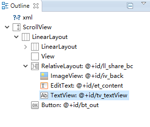

## Scrollview 里包含 ImageView时显示异常 ##

**异常时的ImageView显示:**

**界面布局的层级关系:**

**改正后的界面:**

**界面的代码:**

	<RelativeLayout 
	      android:layout_width="match_parent"
	      android:layout_height="wrap_content"
	      android:id="@+id/ll_share_bc"
	      android:layout_marginLeft="@dimen/size_px2dp_23"
	      android:layout_marginRight="@dimen/size_px2dp_23"
	      android:layout_marginTop="@dimen/size_20_px2dp"
	      >
	        <ImageView
	            android:layout_width="match_parent"
	            android:layout_height="match_parent"
	            android:scaleType="fitCenter"
	            android:id="@+id/iv_back"
	            android:adjustViewBounds="true"
	            android:src="@drawable/bg_share_bc"
	            />
	            ......
				以下省略

只是添加了一句:**`android:adjustViewBounds="true"`**

#### adjustViewBounds 说明: ####

public void `setAdjustViewBounds` (boolean adjustViewBounds) Added in API level 1
	
	Set this to true if you want the ImageView to adjust its bounds to preserve the aspect ratio of its drawable.
	
	Note: If the application targets API level 17 or lower, adjustViewBounds will allow the drawable to shrink the view bounds, but not grow to fill available measured space in all cases. This is for compatibility with legacy MeasureSpec and RelativeLayout behavior.
	
	Related XML Attributes
	android:adjustViewBounds
	
	Parameters
	adjustViewBounds 	Whether to adjust the bounds of this view to preserve the original aspect ratio of the drawable.

	See Also getAdjustViewBounds()
	
	调整ImageView的界限来保持图像纵横比不变。

**`AdjustViewBounds`**:从字面理解,"适应View的边界".这里的ImageView的边界很重要,即你在对ImageView的长宽属性定义时,如果都是wrap_content时,则设置为true是没有效果的.

XML定义里的android:adjustViewBounds="true"会将这个ImageView的scaleType设为fitCenter。不过这个fitCenter会被后面定义的scaleType属性覆盖（如果定义了的话），除非在Java代码里再次显示调用setAdjustViewBounds(true)。
 
如果设置的layout_width与layout_height都是定值，那么设置adjustViewBounds是没有效果的，ImageView将始终是设定的定值的宽高。
 
如果设置的layout_width与layout_height都是wrap_content,那么设置adjustViewBounds是没有意义的，因为ImageView将始终与图片拥有相同的宽高比（但是并不是相同的宽高值，通常都会放大一些）。
 
如果两者中一个是定值，一个是wrap_content，比如layout_width="100px",layout_height="wrap_content"时，ImageView的宽将始终是100px，而高则分两种情况：
（1）当图片的宽小于100px时，layout_height将与图片的高相同，即图片不会缩放，完整显示在ImageView中，ImageView高度与图片实际高度相同。图片没有占满ImageView，ImageView中有空白。
（2）当图片的宽大于等于100px时，此时ImageView将与图片拥有相同的宽高比，因此ImageView的layout_height值为：100除以图片的宽高比。比如图片是500X500的，那么layout_height是100。图片将保持宽高比缩放，完整显示在ImageView中，并且完全占满ImageView。

