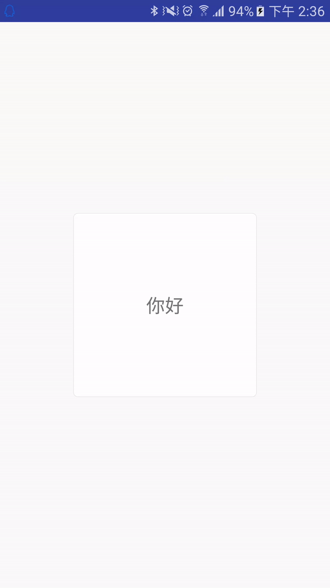
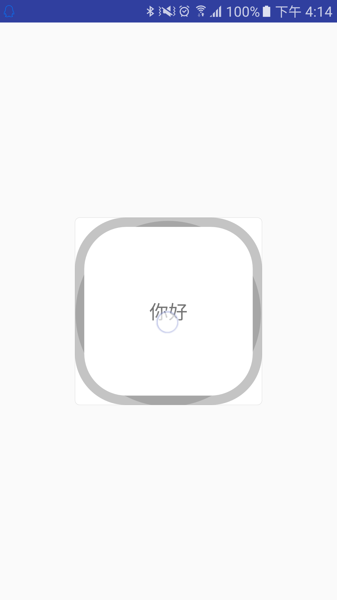

# RippleDrawable 触摸反馈 ---- java 代码编写

### 默认效果(有界 & 无界)
1. 有界: `?Android:attr/selectableItemBackground`
2. 无界: `?android:attr/selectableItemBackgroundBorderless`

**用 xml 自己编写一个无界波纹**
```
<?xml version="1.0" encoding="utf-8"?>
<ripple xmlns:android="http://schemas.android.com/apk/res/android"
    android:color="@color/md_gray_500">
</ripple>
```
**用 xml 自己编写一个有界波纹**
```
<?xml version="1.0" encoding="utf-8"?>
<ripple xmlns:android="http://schemas.android.com/apk/res/android"
        android:color="@color/gray_cc">
    <item android:drawable="@color/white"/>
</ripple>
```

### 代码编写 RippleDrawable

**1. 首先看 `RippleDrawable` 类的构造函数**
```
//xml 中编写的话会执行此无参构造函数
RippleDrawable() {
        this(new RippleState(null, null, null), null);
    }
```
```
//代码编写使用有参构造函数
public RippleDrawable(@NonNull ColorStateList color, @Nullable Drawable content,
            @Nullable Drawable mask) {
        this(new RippleState(null, null, null), null);
		//color: 波纹的颜色,必须要有,没有直接抛异常,程序崩溃
        if (color == null) {
            throw new IllegalArgumentException("RippleDrawable requires a non-null color");
        }
		//content: 背景,当背景为null时,波纹为无界.不为null时为有界.
        if (content != null) {
            addLayer(content, null, 0, 0, 0, 0, 0);
        }
		//mask: 按照说明,mask是不会被draw的,但是它会限制波纹的边界,如果为null,默认为content的边界,同上,当content为null就没有边界了.
        if (mask != null) {
            addLayer(mask, null, android.R.id.mask, 0, 0, 0, 0);
        }
		//省略无关代码...
    }
```

**2. 按照构造参数,提供需要的参数**

> - ColorStateList color
> - Drawable content
> - Drawable mask

我写了个简单的:
```
RippleDrawable drawable=new RippleDrawable(
                ColorStateList.valueOf(Color.GRAY),//灰色波纹
                getResources().getDrawable(R.drawable.shape_cricle_solid_whote_stoke_gray),//一个圆角5dp,白色填充,灰色边框的shape图形,在xml中定义的
                getShape()//编写了一个方法来获取mask
        );
```
用代码编写`shape`在下文会提到.
上面用到的shape xml:
```
<?xml version="1.0" encoding="utf-8"?>
<shape xmlns:android="http://schemas.android.com/apk/res/android"
       android:shape="rectangle">
    <corners android:radius="5dp"/>
    <solid android:color="@color/white"/>
    <stroke
        android:width="1px"
        android:color="@color/gray_cc"/>
</shape>
```
**这里我们的重点放在 mask 的形状上,因为上面说过,mask 会限制波纹扩散的边界,一般情况我们是不需要额外定义的,我们都是拿一个`View`的背景来作为波纹边界----就是`RippleDrawable`第二个参数 `Drawable content`.我们试着去定义,看看实际的限制是如何的.**

### 自定义波纹边界
我的`getshape()`方法写了一个见到的shape:
```
    private Drawable getShape(){
        ShapeDrawable mask =new ShapeDrawable(new RectShape(){
            @Override
            public void draw(Canvas canvas, Paint paint) {
                final float width = this.getWidth();
                final float height = this.getHeight();
                //我想在这个矩形的区域(这里是800px*800px正方形)里画一个 六芒星 ~{=.=}
                //六芒星是上下两个三角形叠加的,所以我画两个三角形就行了.

                //if width == height (为了显示好看,我们设置长宽一样,这里我就认为长宽一样了)
                final float r = width /2 ;
                PointF center = new PointF(width/2,height/2);
                float offsetHeight = (float) (Math.sin(Math.toRadians(30)) * r);
                float offsetWidth = (float) (Math.cos(Math.toRadians(30)) * r);

				//画正三角形
                Path up = new Path();
                up.moveTo(center.x - offsetWidth,center.y + offsetHeight);
                up.lineTo(center.x - offsetWidth,center.y + offsetHeight);
                up.lineTo(center.x,0);
                up.lineTo(center.x + offsetWidth,center.y + offsetHeight);
                up.close();
                canvas.drawPath(up,paint);

				//画倒三角形
                Path down =new Path();
                down.moveTo(center.x - offsetWidth,center.y - offsetHeight);
                down.lineTo(center.x - offsetWidth,center.y - offsetHeight);
                down.lineTo(center.x,center.y * 2);
                down.lineTo(center.x + offsetWidth ,center.y - offsetHeight);
                down.close();
                canvas.drawPath(down,paint);
            }
        });
        return mask;
    }
```
方法比较简单,就是连线,然后画出来.
最后的效果是这样的:


**当然你有想法可以自己去实现,但是基本的就是这样了.嘿嘿**

### 代码编写 Shape 图形
> **首先说一个误区,可能有人认为 Shape 图形对应的是 `ShapeDrawable` ,实际上不是的.这里搬一段源码比较好说明.**

在 **`DrawableInflater 类`有一个方法 `inflateFromTag(String name)`:**
```
    private Drawable inflateFromTag(@NonNull String name) {
        switch (name) {
            case "selector":
                return new StateListDrawable();
            case "animated-selector":
                return new AnimatedStateListDrawable();
            case "level-list":
                return new LevelListDrawable();
            case "layer-list":
                return new LayerDrawable();
            case "transition":
                return new TransitionDrawable();
            case "ripple":
                return new RippleDrawable();
            case "color":
                return new ColorDrawable();
            case "shape"://xml 中<shape>标签对应的是 GradientDrawable
                return new GradientDrawable();
            case "vector":
                return new VectorDrawable();
            case "animated-vector":
                return new AnimatedVectorDrawable();
            case "scale":
                return new ScaleDrawable();
            case "clip":
                return new ClipDrawable();
            case "rotate":
                return new RotateDrawable();
            case "animated-rotate":
                return new AnimatedRotateDrawable();
            case "animation-list":
                return new AnimationDrawable();
            case "inset":
                return new InsetDrawable();
            case "bitmap":
                return new BitmapDrawable();
            case "nine-patch":
                return new NinePatchDrawable();
            default:
                return null;
        }
    }
```
所以对代码编写`Shape`图形:
```
GradientDrawable gradientDrawable=new GradientDrawable();
        int dp50 = DisplayUtil.dp2px(this, 50);
        gradientDrawable.setColor(Color.RED);
        gradientDrawable.setCornerRadius(dp50);
        gradientDrawable.setStroke(dp50/5,Color.BLACK);
```
这样就定义了一个填充色是红色,圆角是50dp,边线是10dp 黑色的Shape图形了.

### 关于 shape 和 RippleDrawable 再说两句

**关于波纹的两层颜色:底层浅一些,上面一层暗一些,源码里是这样写的:**
在`RippleDrawable` 的`draw()`方法里有用来花 `background 与 ripple`的方法 `drawBackgroundAndRipples(canvas);`

```
    private void drawBackgroundAndRipples(Canvas canvas) {
        final RippleForeground active = mRipple;
        final RippleBackground background = mBackground;
        
		//省略无关代码...
        //获取设置的颜色,默认是黑色
        final int color = mState.mColor.getColorForState(getState(), Color.BLACK);
        //获取设置颜色的一半透明度
        final int halfAlpha = (Color.alpha(color) / 2) << 24;
        
        //
        final Paint p = getRipplePaint();
        if (mMaskColorFilter != null) {
			//波动时间取决于颜料的alpha值，因此我们需要将alpha通道推入颜色，并让滤镜处理全alpha颜色。
            final int fullAlphaColor = color | (0xFF << 24);
            mMaskColorFilter.setColor(fullAlphaColor);

            p.setColor(halfAlpha);
            p.setColorFilter(mMaskColorFilter);
            p.setShader(mMaskShader);
        } else {
            final int halfAlphaColor = (color & 0xFFFFFF) | halfAlpha;
            p.setColor(halfAlphaColor);
            p.setColorFilter(null);
            p.setShader(null);
        }
		//省略无关代码...
    }
```
**总结: 也就是这两层,实际上是 `Ripple Color` 和一半透明度的 `Ripple Color`**;

第二点:
当你拿 `Shape` 图形作为 `RippleDrawable`的mask 时,注意,**mask 的有效区域 是要被 Draw的,虽然最终是不会画在你所看到的View上,但是你定义的 Shape 被draw 的部分才能作为 波纹 的边界条件,否则限制无效**

我就拿上面编写的shape图形说明:
```
GradientDrawable gradientDrawable=new GradientDrawable();
        int dp50 = DisplayUtil.dp2px(this, 50);
        //gradientDrawable.setColor(Color.RED);
        gradientDrawable.setCornerRadius(dp50);
        gradientDrawable.setStroke(dp50/5,Color.BLACK);
```
**我注释掉设置填充色的这句,然后看看效果:**

**当我取消注释:**


> 有什么不对的欢迎指正,喜欢点个赞呗~~~~


